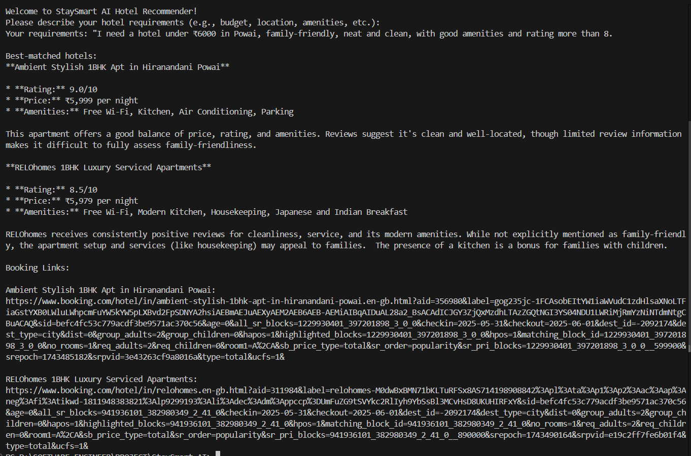

# StaySmart AI  

StaySmart AI is an intelligent hotel recommendation system that uses Gemini AI to provide personalized hotel suggestions based on user preferences. It analyzes hotel data and user requirements to deliver accurate and relevant recommendations.



## Features  
- **Interactive Hotel Search**: Natural language input for hotel preferences (budget, location, amenities, etc.)
- **AI-Powered Recommendations**: Gemini AI analyzes queries and hotel data for precise matches
- **Comprehensive Hotel Data**: Detailed information including reviews, ratings, pros, and cons
- **Secure Configuration**: Environment variables and .gitignore for sensitive data protection
- **User-Friendly Interface**: Clear and formatted output with booking links

## Project Structure  
```plaintext  
StaySmart AI/
├── backend/  
│   ├── data/  
│   │   └── cleaned_powai_hotels.json    # Processed hotel data
│   ├── src/  
│   │   └── main.py                      # Main application logic
│   └── keys/  
│       └── google_cloud_key.json        # Google Cloud credentials
├── notebooks/                           # Jupyter notebooks for data analysis
├── .env                                # Environment variables
├── .gitignore                          # Git ignore rules
└── README.md                           # Project documentation
```  

## Prerequisites
- Python 3.8+
- Google Cloud account with Gemini AI access
- Required Python packages (see requirements.txt)

## Installation  
1. Clone the repository:  
   ```bash  
   git clone https://github.com/your-repo/StaySmart-AI.git  
   cd StaySmart-AI
   ```  

2. Create and activate virtual environment:
   ```bash
   python -m venv .venv
   .venv\Scripts\activate  # Windows
   source .venv/bin/activate  # Linux/Mac
   ```

3. Install dependencies:  
   ```bash  
   pip install -r requirements.txt  
   ```  

4. Set up environment variables:
   - Copy `.env.example` to `.env`
   - Update the paths in `.env`:
     ```
     GOOGLE_APPLICATION_CREDENTIALS=path/to/your/google_cloud_key.json
     DATA_FILE_PATH=path/to/your/cleaned_powai_hotels.json
     ```

## Usage  
1. Run the application:  
   ```bash  
   python backend/src/main.py  
   ```  

2. Enter your hotel requirements when prompted:
   ```
   Welcome to StaySmart AI Hotel Recommender!
   Please describe your hotel requirements (e.g., budget, location, amenities, etc.):
   Your requirements: [Enter your preferences]
   ```

3. View the recommendations with detailed information and booking links.

## Example Output
The system will display:
- Best-matched hotels with detailed information
- Reasons for matching
- Booking links for recommended hotels
- Clear formatting for easy reading

## Security
- API keys and sensitive data are stored in `.env`
- `.gitignore` prevents accidental commits of sensitive files
- Environment variables for secure configuration

## Contributing  
1. Fork the repository
2. Create your feature branch (`git checkout -b feature/AmazingFeature`)
3. Commit your changes (`git commit -m 'Add some AmazingFeature'`)
4. Push to the branch (`git push origin feature/AmazingFeature`)
5. Open a Pull Request

## License  
This project is licensed under the MIT License - see the LICENSE file for details.

## Contact
For any queries or suggestions, please open an issue in the repository.  

